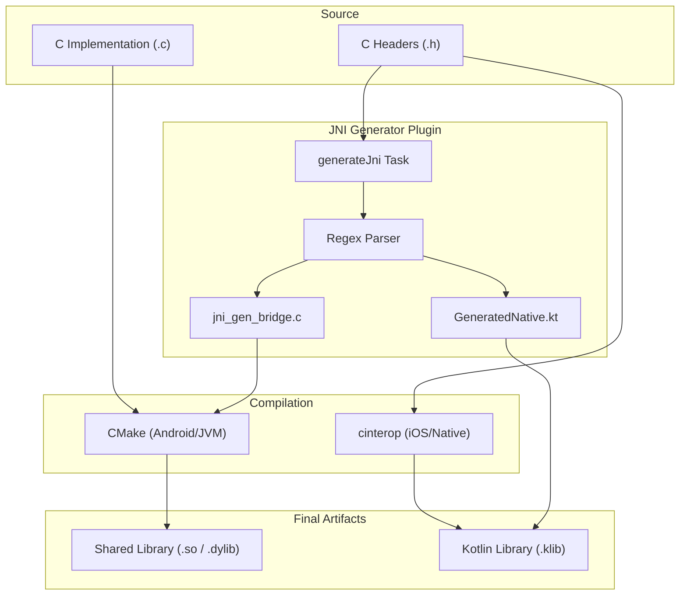

# Bridging the Gap: Automating C Bindings in Kotlin Multiplatform

Integrating native C/C++ code into a Kotlin Multiplatform (KMP) project often feels like paying a "native tax." You have to maintain multiple glue layers: JNI for Android and JVM, CInterop for iOS and Native, and often redundant build logic in CMake and Gradle.

What if you could maintain a single C source directory and have the bindings generated for you automatically?

Introducing **CBindingKMP** — a library designed to automate the bridge between your performance-critical C code and your KMP applications.

---


---

## The Problem: The "Native Tax"

When you decide to use C in a KMP project, you typically face three distinct challenges:

1.  **Android & JVM**: You must write manual JNI wrappers (C functions with long, brittle names like `Java_com_example_GeneratedNativeKt_add_1numbersJNI`) and use CMake to build shared libraries.
2.  **iOS & Native**: You need to configure `.def` files and use Kotlin/Native's CInterop tool.
3.  **Synchronization**: Every time you change a C function signature, you have to manually update the JNI wrapper, the Kotlin `external fun` declaration, and the CInterop headers.

This redundancy is a breeding ground for bugs and maintenance headaches.

---

## The Solution: CBindingKMP

CBindingKMP turns your C headers into a **Single Source of Truth**. By pointing our Gradle plugin to your headers, it automatically:

-   **Parses** your C function declarations.
-   **Generates** JNI-compliant C wrappers for Android and JVM.
-   **Generates** Kotlin `external fun` declarations that map directly to the JNI wrappers.
-   **Wires** everything into the Gradle build cycle.

---

## How It Works: Under the Hood

The architecture is designed to be seamless. Here's how the automation flow looks:



### Type Mapping
We handle the heavy lifting of type conversion between C, JNI, and Kotlin types:

| C Type   | JNI Type  | Kotlin Type |
| :------- | :-------- | :---------- |
| `int`    | `jint`    | `Int`       |
| `float`  | `jfloat`  | `Float`     |
| `double` | `jdouble` | `Double`    |
| `void`   | `void`    | `Unit`      |

---

## Quick Start: From C to Kotlin in 3 Steps

### 1. Define your C function
Create a simple header in `native/c/mylib.h`:
```c
int add_numbers(int a, int b);
```

### 2. Build the project
Run the Gradle assemble task. The plugin will automatically parse the header and generate the bridge.
```bash
./gradlew :shared:assemble
```

### 3. Call from Kotlin
The generated bindings are ready to use immediately:
```kotlin
import com.abyxcz.cbindingkmp.shared.generated.add_numbersJNI

val result = add_numbersJNI(10, 20)
println("Result from C: $result")
```

---

## Why Use CBindingKMP?

-   **🚀 Zero Glue Code**: Stop writing JNI boilerplate.
-   **🛠 Unified Source**: One directory for all platforms.
-   **📱 Full Platform Support**: Android, iOS, JVM, and Native.
-   **⚙️ Gradle Integrated**: Fits right into your existing workflow.

If you're building performance-intensive apps—think image processing, cryptography, or edge AI—CBindingKMP lets you focus on the logic, not the plumbing.

Check out the project on [GitHub](https://github.com/abyxcz/CBindingKMP) and let us know what you think!
