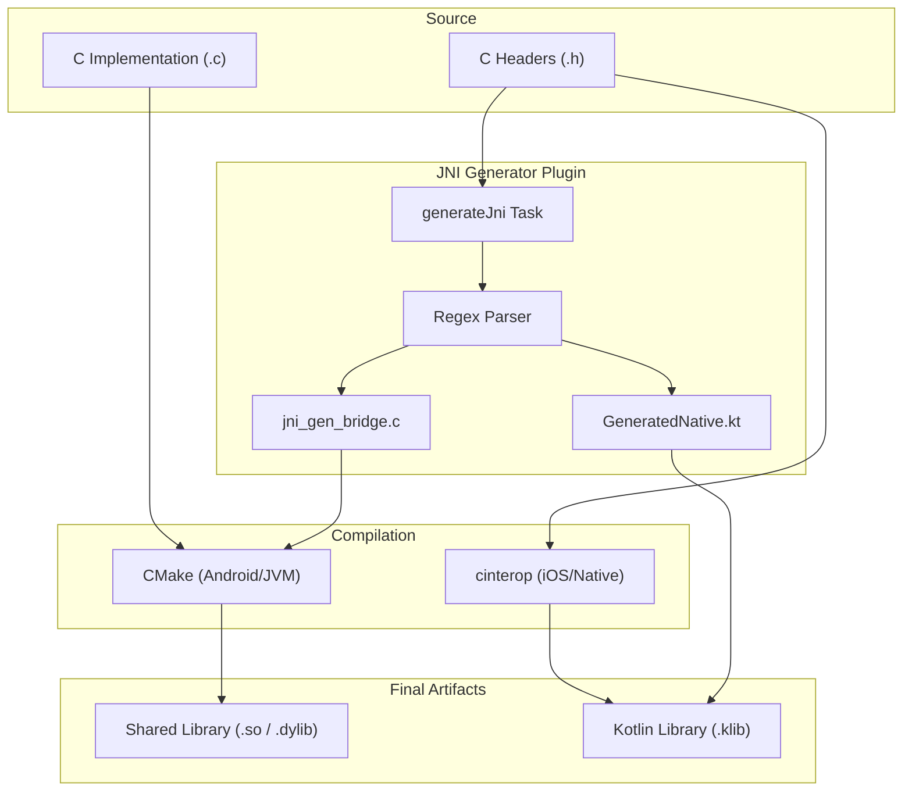

# Architecture and Automation Logic

CBindingKMP is built on the principle of "Single Source of Truth." This document explains how the Gradle plugin, CMake, and CInterop work together to automate the native bridge.

## Core Components

### 1. JNI Generator Gradle Plugin

The heart of CBindingKMP is the `com.abyxcz.cbinding` Gradle plugin. It registers the `generateJni` task, which performs the following operations:

-   **Header Parsing**: Scans the input directory for `.h` files. It uses a regex-based parser to identify function signatures like `int add_numbers(int a, int b);`.
-   **JNI Wrapper Generation**: For each identified C function, it generates a JNI-compliant wrapper in `jni_gen_bridge.c`.
    -   Example: `add_numbers` becomes `Java_com_abyxcz_cbindingkmp_shared_generated_GeneratedNativeKt_add_numbersJNI`.
-   **Kotlin Binding Generation**: It simultaneously generates a Kotlin file `GeneratedNative.kt` with `internal external fun` declarations for each function.

### 2. CMake Integration (Android/JVM)

For Android and JVM targets, the native code is built using CMake.
-   The `shared/build.gradle.kts` file points to the root `CMakeLists.txt` via `externalNativeBuild`.
-   The `jni_gen_bridge.c` file is included in the CMake build, ensuring that the JNI symbols are available in the resulting shared library (`.so`, `.dylib`, or `.dll`).

### 3. CInterop Configuration (iOS/Native)

For Apple and other native targets, Kotlin/Native's `cinterop` tool is used.
-   A `.def` file is configured in `shared/src/nativeInterop/cinterop/mylib.def`.
-   The `cinterop` task directly imports the headers from the `native/c` directory.
-   Since Kotlin/Native can call C functions directly, no intermediate JNI bridge is needed for these targets.

## Build Flow Diagram

## Type Mapping

CBindingKMP uses a deterministic mapping between C types, JNI types, and Kotlin types:

| C Type   | JNI Type  | Kotlin Type |
| :------- | :-------- | :---------- |
| `int`    | `jint`    | `Int`       |
| `void`   | `void`    | `Unit`      |
| `float`  | `jfloat`  | `Float`     |
| `double` | `jdouble` | `Double`    |
| Other    | `jobject` | `Any`       |

## Native Loading Mechanism

The `NativeLoader` object uses `expect/actual` to handle platform-specific loading:
-   **Android/JVM**: `System.loadLibrary("mylib")` is called.
-   **iOS**: No action is taken as symbols are statically linked.
